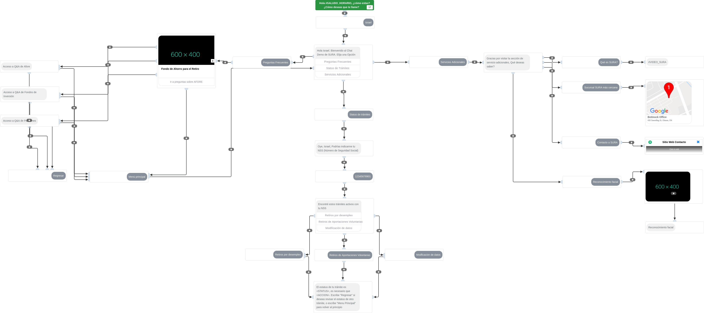
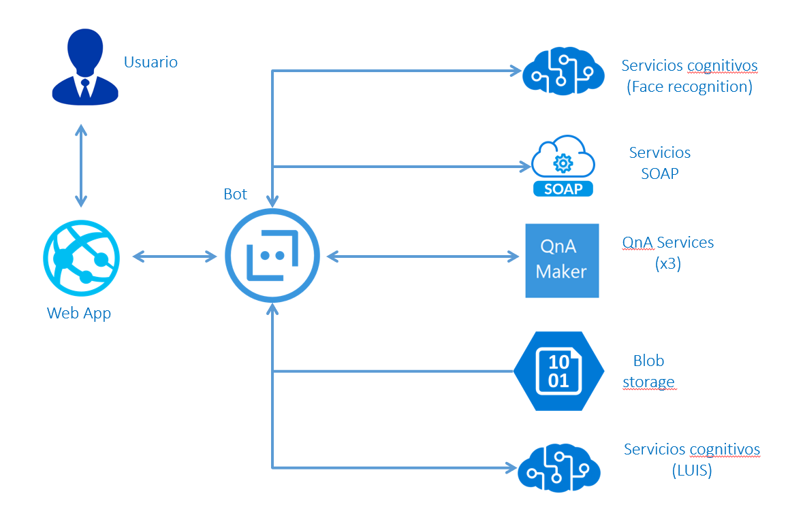

# Proyecto de bot de demostración Sura-Mexico

Este proyecto está diseñado para crear un bot que funcione como demostración de lo que la plataforma de bots de Microsoft tiene capacidad de hacer.

## Flujo de la conversación

Las características del bot se encuentran dentro del siguiente flujo de conversación.

Si deseas ver la versión completa y con posibilidad de acercamiento a detalle del flujo puedes descargar [aquí el documento]("https://github.com/aminespinoza/Sura-Mexico/Assetsexport.pdf").

Basándonos en la funcionalidad que el bot implementará, la arquitectura del mismo es la siguiente.

Por medio de un menú inicial con tres diferentes opciones el usuario tendrá la facultad de moverse a las secciones de:

- Preguntas y respuestas frecuentes
- Consulta de trámites
- Servicios adicionales de Sura

Miembros del equipo:

Luis Raúl Mata.  Sura México. Ingeniero de Software.  
Israel Linarez. Sura México. Ingeniero de Software.  
Amin Espinoza. Microsoft. Ingeniero de Software.  